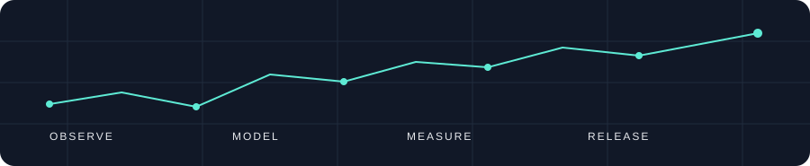

# Anshaj Malhotra

I build at the intersection of embedded sensing, positioning, and useful data products. I like interfaces that feel calm, experiments that can be repeated, and releases that can be traced back to tested code.

### Selected work

| Project | What to explore |
| --- | --- |
| [RTLS Bridge](https://github.com/AnshajMalhotra/RTLS-Bridge) | A reproducible UWB and RSSI positioning benchmark. Compare estimators through [measured results](https://github.com/AnshajMalhotra/RTLS-Bridge/blob/main/out/report.md), [CI](https://github.com/AnshajMalhotra/RTLS-Bridge/actions/workflows/ci.yml), and a [versioned release](https://github.com/AnshajMalhotra/RTLS-Bridge/releases). |
| [Fuel Cell Monitoring](https://github.com/AnshajMalhotra/Fuel-Cell-Monitoring-) | KiCad board and ESP32-S3 firmware for voltage and current acquisition. |
| [Automotive Quality Report](https://github.com/AnshajMalhotra/Automotive-Quality-Intelligence-Measurement-Analytics-Platform) | A Power BI project with synthetic inspection data and independently checked reference KPIs. |
| [Engineering Portfolio](https://github.com/AnshajMalhotra/Portfolio-Anshaj) | The React and Vite source for my [portfolio site](https://anshajm.vercel.app/). |

### How I work

`observe` → `model` → `measure` → `verify` → `release`

I keep assumptions near the code, publish the evidence behind a result, and use small versioned changes. RTLS Bridge shows the full path: [source and tests](https://github.com/AnshajMalhotra/RTLS-Bridge), a [GitHub Actions pipeline](https://github.com/AnshajMalhotra/RTLS-Bridge/actions), and a [changelog](https://github.com/AnshajMalhotra/RTLS-Bridge/blob/main/CHANGELOG.md).

Python · C/C++ · embedded systems · simulation · data visualisation
