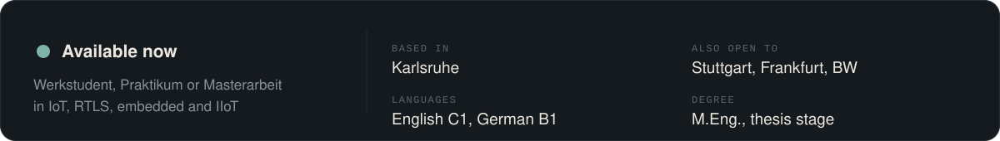
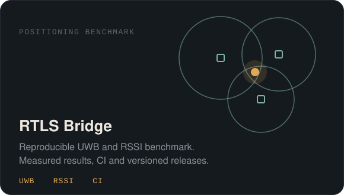
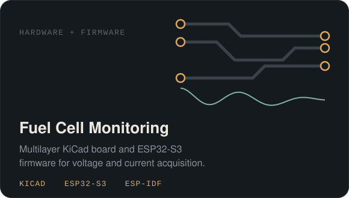
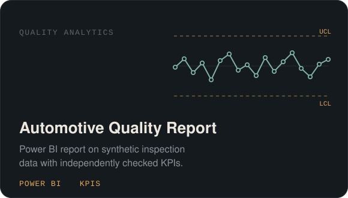
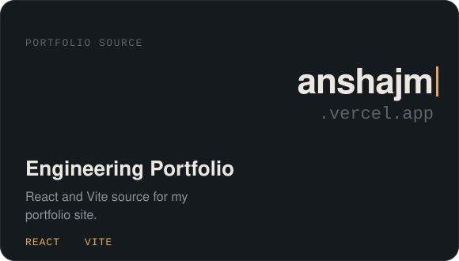
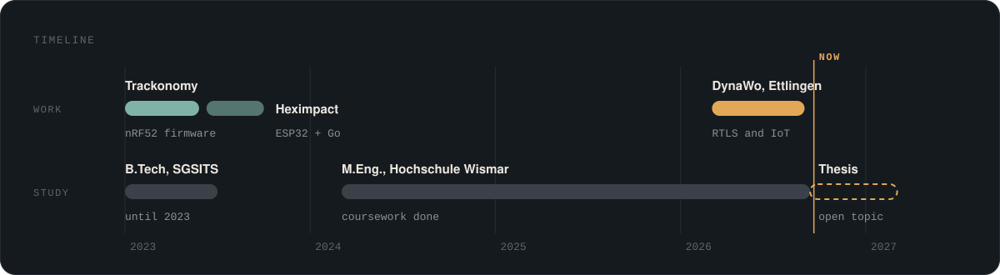
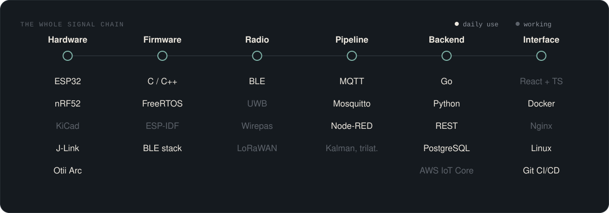
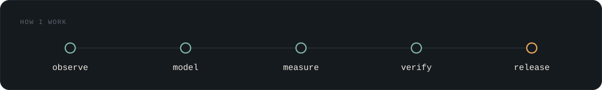

I build at the intersection of embedded sensing, positioning, and useful data products. I like interfaces that feel calm, experiments that can be repeated, and releases that can be traced back to tested code.

### Selected work

  
  

  
  

RTLS Bridge in detail: [measured results](https://github.com/AnshajMalhotra/RTLS-Bridge/blob/main/out/report.md), [CI](https://github.com/AnshajMalhotra/RTLS-Bridge/actions/workflows/ci.yml), [releases](https://github.com/AnshajMalhotra/RTLS-Bridge/releases) and [changelog](https://github.com/AnshajMalhotra/RTLS-Bridge/blob/main/CHANGELOG.md).

### Experience

<b>IoT Solution Manager, DynaWo GmbH & Co. KG, Ettlingen</b> (03/2026 - 08/2026)

 
Internship 03/2026 - 05/2026, then Werkstudent 06/2026 - 08/2026. Built Locate-IQ, an internal platform for comparing RTLS hardware across BLE, UWB, Wirepas and LoRaWAN, using React, TypeScript and NocoDB on a Linux VM I ran with Docker and Nginx. Set up MQTT pipelines from BLE gateways through Mosquitto and Node-RED, and tested an RSSI location engine against LiDAR-SLAM ground truth.

<b>IoT Firmware and Backend Developer, Heximpact, Indore</b> (06/2023 - 09/2023)

 
ESP32 firmware on FreeRTOS with BLE iBeacon, and a Go backend for sensor data on AWS IoT Core and PostgreSQL.

<b>Firmware Trainee, Trackonomy, Indore</b> (01/2023 - 05/2023)

 
BLE firmware in C on nRF52810 and nRF52832, including low-power modes and OTA. Wrote more than 100 grey-box test cases for four patented products.

### Skills

I keep assumptions near the code, publish the evidence behind a result, and use small versioned changes.

### Contact

[anshajm9@gmail.com](mailto:anshajm9@gmail.com) 
[LinkedIn](https://www.linkedin.com/in/anshaj-malhotra-19023514a) 
[Portfolio](https://anshajm.vercel.app/)

